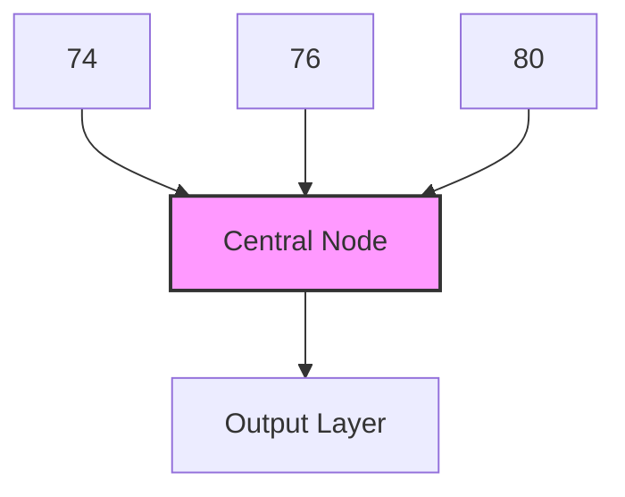

# Generative Modeling of Neurodegenerative Brain Anatomy with 4D Longitudinal Diffusion Model

Nivetha Jayakumar∗

Department of Electrical and Computer Engineering, University of Virginia, Charlottesville, 22903, VA, USA

Swakshar Deb\*

Department of Electrical and Computer Engineering, University of Virginia, Charlottesville, 22903, VA, USA

Bahram Jafrasteh

Department of Radiology, Weill Cornell Medical College, Cornell University, Ithaca, 14850, NY, USA

Qingyu Zhao

Department of Radiology, Weill Cornell Medical College, Cornell University, Ithaca, 14850, NY, USA

Miaomiao Zhang

Department of Electrical and Computer Engineering, Department of Computer Science, University of Virginia, Charlottesville, 22903, VA, USA

# Abstract

Understanding and predicting the progression of neurodegenerative diseases remains a major challenge in medical AI, with significant implications for early diagnosis, disease monitoring, and treatment planning. However, most available longitudinal neuroimaging datasets are temporally sparse with a few follow-up scans per subject. This scarcity of temporal data limits our ability to model and accurately capture the continuous anatomical changes related to disease progression in individual subjects. To address this problem, we propose a novel 4D (3D×T) diffusion-based generative framework that effectively models and synthesizes longitudinal brain anatomy over time, conditioned on available clinical variables such as health status, age, sex, and other relevant factors. Moreover, while most current approaches focus on manipulating image intensity or texture, our method explicitly learns the data distribution of topology-preserving spatiotemporal deformations to effectively capture the geometric changes of brain structures over time. This design enables the realistic generation of future anatomical states and the reconstruction of anatomically consistent disease trajectories, providing a more faithful representation of longitudinal brain changes. We validate our model through both synthetic sequence generation and downstream longitudinal disease classification, as well as brain segmentation. Experiments on two large-scale longitudinal neuroimage datasets demonstrate that our method outperforms state-of-the-art baselines in generating anatomically accurate, temporally consistent, and clinically meaningful brain trajectories. Our code is available on Github.

Keywords: Longitudinal Neurodegeneration, Generative Modeling, Deformation-Based Morphometry

# 1. Introduction

Neurodegenerative diseases such as Alzheimer’s disease are characterized by gradual, spatially heterogeneous atrophy of brain structures that precede clinical symptoms by years [50, 22, 51]. Understanding the morphometric and geometric changes of brain structures is essential for early diagnosis, individualized prognosis, and timely therapeutic intervention [16, 36]. However, longitudinal neuroimaging data are often temporally sparse, incomplete, or entirely unavailable due to challenges such as high imaging costs, patient dropout, and the difficulty of conducting repeated scans over extended study periods [37, 39]. This raises a clinically and technically significant question: can we predict an individual’s future anatomical trajectory from a single baseline scan? Solving such a task would benefit early identification of high-risk individuals, simulate future disease progression, and better support clinical trials aimed at an early-stage intervention.

Recent advances in generative modeling have opened new possibilities for synthesizing future or missing brain imaging scans from limited longitudinal observations [64, 61, 58]. Early generative approaches, such as generative adversarial networks (GANs) [25, 41], demonstrated initial promise but often suffered from instability, limited sample diversity, and mode collapse. Such issues hinder their ability to model the full variability of neurodegenerative processes. In contrast, denoising diffusion probabilistic models (DDPMs) [18] have recently emerged as powerful alternatives capable of capturing complex, high-dimensional distributions of brain morphology with remarkable stability and fidelity [64, 26, 27]. By conditioning on auxiliary variables such as age, cognitive scores, disease status, and anatomical priors, diffusion-based frameworks have demonstrated promising results in generating high-quality, high-resolution 2D brain scans to model disease progression and structural degeneration. These advances represent a significant step toward data-driven, predictive modeling of neurodegeneration in clinical neuroscience.

# 1.1. Related Works

Current generative diffusion models synthesize brain anatomy by directly manipulating image intensities or textures, without explicitly modeling the underlying geometry of anatomical structures [64, 27]. As a result, these methods may produce anatomically implausible samples, including unrealistic topology and structural distortions [60, 19]. To address this, recent work has incorporated deformation-based morphometry (DBM) into generative frameworks [43, 26], representing brain changes as smooth transformations between pairwise images rather than direct intensity edits. Such transformations maintain one-to-one correspondences across time and subjects, preventing folding, tearing, or discontinuous warping [15, 19]. This property is particularly critical for studying progressive neurodegenerative diseases, where capturing subtle localized atrophy requires maintaining anatomical plausibility. Despite these advantages, existing DBM-based generative methods remain limited as they primarily model deformations between pairwise images while intermediate time points are generated via temporal interpolation [26]. These approaches do not explicitly model the true longitudinal progression trajectory, thus failing to synthesize subsequent scans that reflect realistic, temporally consistent anatomical changes over several time points.

More importantly, existing generative models are fundamentally limited in their ability to process full 4D (3D × T) neuroimaging data. Most current approaches can synthesize only sequential 2D slices (2D x T) [58], or a single 3D follow-up volume [19], but they cannot generate anatomically coherent 3D sequences that evolve continuously over time. Therefore, they are unable to produce full 4D longitudinal trajectories from a single baseline scan. To alleviate this issue, several diffusion-based methods propose to synthesize follow-up scans by conditioning on a sequence of prior scans [32, 60] or rely on auxiliary information such as image-derived features, radiomics [12, 11], and regional atrophy measurements [44, 46]. However, these methods assume access to multiple longitudinal scans, costly brain segmentations, or additional imaging modalities at inference time, all of which are rarely available in routine clinical workflows; hence substantially limiting their real-world applicability. Meanwhile, recent 4D diffusion models emerging in computer vision focus on synthesizing dynamic 3D scenes from fusing multiple camera viewpoints [62, 31, 56]. These methods are inherently tailored to multi-view consistency and camera pose estimation, making them fundamentally incompatible with the challenge of modeling biological shape changes over time in longitudinal neuroimaging.

In this paper, we propose a novel 4D longitudinal diffusion model in the time-sequential deformation space of brain images. In contrast to existing approaches [43, 20] that are limited to 2D or 3D architectures - thereby sacrificing either spatial or temporal fidelity - our framework fully captures spatiotemporal anatomical dynamics by modeling a diffusion process over a sequence of 3D deformation fields. These deformation fields are parameterized by stationary velocity fields, enabling smooth, invertible transformations that preserve anatomical topology [53]. To support this 4D generative modeling, we introduce a new frame-wise volumetric patch embedding strategy that tokenizes each 3D volume independently while maintaining temporal consistency across the sequence. This allows us to explicitly learn the temporal evolution of brain structures without compromising spatial detail or anatomical plausibility. Our contributions are summarized below:

• To the best of our knowledge, we are first to develop a full 4D diffusion network for longitudinal brain modeling that jointly learns spatial and temporal features, which extends current architectures beyond 3D without compromising either dimension.   
• Develop a novel diffusion model in spatiotemporal deformation spaces to ensure smooth, topology-preserving transformations and anatomically consistent results.   
• Demonstrate utility of the generated samples in two downstream tasks: AD classification and brain segmentation via augmentation with missing data from longitudinal neuroimage repositories. It is worthy to note that our designed network architecture is flexible and can operate in both the intensity and deformation spaces.

We evaluate the effectiveness of our proposed framework on longitudinal brain MRI data from the ADNI repository [42]. Experimental results demonstrate that our method excels at generating longitudinal sequences with preserved anatomical structure and shape, outperforming state-of-theart diffusion models that operate in the pixel space, as well as recursive models that synthesize missing time points using multi-frame guidance.

# 2. Background: Deformation-based Brain Morphometry

This section outlines the formulation of topological constraints within the framework of deformation-based brain morphometry by leveraging diffeomorphic transformations between source and target brain images [35, 17]. In the context of longitudinal neuroimaging, it is typically assumed that any pair of scans acquired from the same subject over time can be related through a continuous deformation field [4, 47, 23]. To ensure anatomical fidelity and preserve the underlying brain topology, these deformation fields are constrained to lie within the space of diffeomorphisms, i.e., smooth, invertible mappings with smooth inverses [6, 2, 59]. These topological constraints are essential in DBM, as they prevent non-physical artifacts such as folding, tearing, or self-intersections in the warped anatomy, enabling reliable quantification of structural changes over time.

Given a template image S and a fixed image F defined on a d-dimensional torus domain $\Omega = \mathbb { R } ^ { d } / \mathbb { Z } ^ { d } \ ( S ( x ) , F ( x ) : x \in \Omega  \mathbb { R } )$ , a diffeomorphic transformation, $\phi _ { t }$ , for $t \in [ 0 , 1 ]$ , is defined as a smooth flow over time to deform a template image to a fixed image by a composite function, $S \circ \phi _ { t } ^ { - 1 }$ . Here, the ◦ denotes an interpolation operator. Such a transformation is typically parameterized by time-dependent velocity fields under a large diffeomorphic deformation metric mapping (LDDMM) [6], or a stationary velocity field (SVF), which remains constant over time and is obtained using the scalingand-squaring algorithm [53, 3]. While we employ SVF in this paper, our framework is easily applicable to the other. For a stationary velocity field v, the diffeomorphisms, $\phi _ { t }$ , are generated as solutions to the equation:

$$
d \phi_ {t} / d t = v \circ \phi_ {t}, \text {   s.t.   } \phi_ {0} = x. \tag {1}
$$

The solution of Eq. (1) is identified as a group exponential map using a scaling and squaring scheme [3]. More details are included in [3].

The diffeomorphic transformation, $\phi$ at $t ~ = ~ 1$ , that reflects geometric changes between images can be solved by minimizing the energy function:

$$
E (v) = \eta \operatorname{Dist} (S \circ \phi_ {1} ^ {- 1} (v), F) + \operatorname{Reg} (v), \text {s.t. Eq. (1).} \tag {2}
$$

Here Dist(·,·) is a distance function that measures the dissimilarity between images, Reg(·) is a regularization term that enforces the smoothness of transformation fields, and η is a positive weighting parameter. Widely used distance functions include the sum-of-squared intensity differences $\left( L _ { \mathrm { 2 } } \mathrm { - n o r m } \right)$ [6], normalized cross correlation (NCC) [4], and mutual information (MI) [57]. In this paper, we utilize a sum-of-squared distance function.

# 3. Our Method

This section introduces a novel 4D longitudinal diffusion model, which comprises of two main components: (i) a diffeomorphic registration network $\mathrm { U } _ { \varphi }$ [5] that extracts DBM from the longitudinal brain images via velocity fields; and (ii) a 4D diffusion model $\psi _ { \theta }$ that learns to synthesize a time sequence of velocity fields conditioned on clinical and anatomical context. An overall network architecture is presented in Figure 1.

Problem Setup. Different from 4D video or motion data [26, 33], longitudinal neuroimaging data consists of discrete 3D volumetric brain scans acquired at irregular and subject-specific time points. Consider a set of N longitudinal images, for each subject $n \in [ 1 , \cdots , N ]$ , let $a _ { t , n } \in \{ a _ { 0 , n } , a _ { 1 , n } , . . . , a _ { T , n } \}$ denote the age at the t-th scan, where T is the total number of time frames and $a _ { 0 , n }$ corresponds to the baseline age. The corresponding baseline brain volume is denoted by $I _ { a _ { 0 , n } } \in \mathbb { R } ^ { H \times W \times L }$ , where H, W, L are the spatial dimensions of the 3D MRI scan. Given this baseline scan and associated clinical/demographic information such as the subject’s disease label $y _ { n } .$ , our objective is to model a sequence of anatomically plausible follow-up brain volumes, $\{ I _ { a _ { 1 , n } } , I _ { a _ { 2 , n } } , \ldots , I _ { a _ { T , n } } \}$ , corresponding to subject-specific, non-uniform age intervals $\Delta a _ { t , n } = a _ { t + 1 , n } - a _ { t , n }$ , which may vary across individuals.

We first learn the velocity fields from the longitudinal MRIs using a diffeomorphic registration network [5]. Specifically, the baseline scan, ${ \cal I } _ { a _ { 0 } , n } ,$ is independently registered to each follow-up scan, ${ \cal I } _ { a _ { t } , n } .$ , resulting in a set of initial velocity fields, i.e., $\left\{ v _ { a _ { 1 } , n } , v _ { a _ { 2 } , n } , . . . v _ { a _ { T } , n } \right\}$ . These velocity fields are then integrated by Eq. (1) to obtain smooth, invertible deformation maps $\{ \phi _ { a _ { 1 } , n } ^ { - 1 } , \phi _ { a _ { 2 } , n } ^ { - 1 } , . . . \phi _ { a _ { T } , n } ^ { - 1 } \}$ that capture the anatomical transformations from the baseline to each follow-up time point. Let $\varphi$ denote the parameters of the registration network, we define the associated loss function as

$$
l (\varphi) = \sum_ {n = 1} ^ {N} \lambda | | I _ {a _ {0}, n} \circ \phi_ {a _ {t}, n} ^ {- 1} (v _ {a _ {t}, n} (\varphi)) - I _ {a _ {t}, n} | | _ {2} ^ {2} + | | \nabla v _ {a _ {t}, n} (\varphi) | | ^ {2},
$$

where $\vert \vert \nabla v _ { a _ { t } , n } ( \varphi ) \vert \vert ^ { 2 }$ is a regularizer enforcing smoothness of the transformations with λ being a positive weighting parameter. These predicted velocities serve as training inputs for the longitudinal 4D diffusion model.

# 3.1. 4D Longitudinal Diffusion Model

Inspired by denoising diffusion probabilistic models [18], we develop a diffusion transformer that explicitly models longitudinal sequences within each step of the Markov chain. More specifically, our model learns to approximate the data distribution defined over temporal sequences of velocity fields, i.e., $\mathbf { z _ { n } } \triangleq \{ v _ { a _ { 0 } , n } , v _ { a _ { 1 } , n } , . . . v _ { a _ { T } , n } \}$ . Specifically, each input sequence is a 4D tensor $\mathbf { z } \in \mathbb { R } ^ { C \times T \times H \times W \times L }$ , where C is the number of channels $( \mathrm { i . e . , } \ C = 3 )$ . For simplicity, we drop the batch notation $n .$ . The forward process progressively perturbs the input data over a fixed number of timesteps, transforming it into a distribution that approximates a standard Gaussian. At an intermediate timestep, $\tau \in \{ 1 , \cdots , \mathcal { T } \}$ , the diffusion process can be formulated as


<details>
<summary>flowchart</summary>

4D Longitudinal Diffusion Model architecture flowchart, showing data flow from Baseline Scan through Spatial Gradient, Registration Net, and Predicted Noise to final output.
</details>


<details>
<summary>flowchart</summary>


</details>


<details>
<summary>flowchart</summary>

```mermaid
graph TD
    A["Position Information"] --> B["Spatial Indices"]
    A --> C["Temporal Indices"]
    A --> D["Age Embedding"]
    B --> E["Position Encoding"]
    C --> E
    D --> E
    E --> F["[0.85, 0.23, 0.33, 0.978, ..., 0.556"]]
    F --> G["Waveform 1"]
    F --> H["Waveform 2"]
    F --> I["Waveform 3"]
```
</details>

Figure 1: The overall architecture of our framework.

$$
q (\mathbf {z} ^ {\tau} | \mathbf {z} ^ {\tau - 1}) = \mathcal {N} (\mathbf {z} ^ {\tau}; \sqrt {1 - \beta_ {\tau}} \mathbf {z} ^ {\tau - 1}, \beta_ {\tau} \mathbf {I}), \tag {3}
$$

where $\beta _ { \tau }$ controls the noise variance. After re-parametrization, the last timestep of this Markov chain can be obtained as a single step process using the formulation $\mathbf { z } ^ { T } = \sqrt { \bar { \alpha } _ { \tau } } \mathbf { z } ^ { 0 } + \sqrt { 1 - \bar { \alpha } _ { \tau } } \epsilon$ where $\epsilon \sim \mathcal { N } ( 0 , \mathbf { I } ) , \alpha _ { \tau } = 1 - \beta _ { \tau }$ and $\begin{array} { r } { \bar { \alpha } _ { \tau } = \prod _ { s = 1 } ^ { \tau } \alpha _ { s } } \end{array}$ .

The reverse process reconstructs the signal by iteratively sampling from a Gaussian distribution using

$$
p _ {\theta} (\mathbf {z} ^ {\tau - 1} | \mathbf {z} ^ {\tau}) = \mathcal {N} (\mathbf {z} ^ {\tau - 1}, \mu_ {\theta} (\mathbf {z} ^ {\tau}, \tau , \mathcal {C}), \Sigma_ {\theta} (\mathbf {z} ^ {\tau}, \tau , \mathcal {C})), \tag {4}
$$

where $\mu _ { \theta }$ and $\Sigma _ { \theta }$ represent the mean and variance of the process at timestep $\tau _ { : }$ estimated by a network $\psi _ { \theta }$ parameterized by θ. As shown in [18], we can directly estimate the reverse process mean function estimator by training a neural network to predict ϵ from $\mathbf { z } _ { \tau }$ based on a set of conditional signals C.

To effectively model full 4D longitudinal sequences, we propose a new transformer-based architecture to replace the conventional U-Net denoising network, $\psi _ { \theta } ,$ parameterized by θ. Drawing inspiration from the video vision transformer [1], we redesign the denoising backbone with dedicated components optimized for spatiotemporal modeling, as described below:

Longitudinal Volumetric Patch Embedding (LVPE). Existing methods generate longitudinal data by processing sequences of 3D volumes [60, 33]; however, they often compromise either spatial or temporal coherence by flattening or reshaping the input sequence to make it compatible to current transformer architectures. To address this, we introduce a patch extraction mechanism that operates in the 4D spatiotemporal domain. More specifically, we first apply a 3D convolutional-based patch embedder κ independently to each temporal frame, as brain anatomical topology remains fundamentally stable across time points with minor deformations occurring between scan intervals.

We then partition each 3D volume into non-overlapping patches and project them into a fixed-dimensional embedding space $\mathbb { R } ^ { d }$ of dimension d, yielding a patch token tensor of shape $m \in \mathbb { R } ^ { T \times N _ { d } \times d }$ , where $N _ { d } = ( H \times W \times L ) / P ^ { 3 }$ is the number of spatial patches per frame with a patch size of P . Formally, the embedding process is defined as

$$
m _ {a _ {t}} = \kappa (\mathbf {z} _ {a _ {t}}), \quad \forall a _ {t} \in \{a _ {1}, \ldots , a _ {T} \},
$$

$$
m = \left[ m _ {a _ {1}} m _ {a _ {2}} \dots , m _ {a _ {T}} \right], m \in \mathbb {R} ^ {T \times N _ {d} \times d}.
$$

Note that our proposed operation differs from current works [40, 34] by incorporating 4D data through frame-wise 3D patch embeddings. This approach preserves the fine-grained spatial structure within each 3D volume while maintaining temporal correspondence across time points, enabling effective decoupling of spatial and temporal modeling in subsequent transformer layers. In contrast to tubelet-based embeddings [63, 49] that extract spatiotemporal tubes assuming uniform temporal spacing, our frame-wise patch extraction is naturally suited to longitudinal medical data with irregular age intervals $\Delta a _ { t }$ . This design choice avoids the need for temporal interpolation or padding, reducing computational overhead while improving modeling flexibility.

Age-aligned Patchwise Position Encoding (APPE). The patches extracted from the input sequence are enriched with both spatial and temporal positional encodings to preserve temporal alignment and to capture global spatiotemporal dependencies. A key innovation of our design is a two-step temporal alignment strategy. First, we introduce a temporally aware encoding that embeds age information directly into the sinusoidal positional functions, enabling the model to reason about continuous biological time. Second, we incorporate a complementary fixed 1D temporal embedding assigned to each volumetric patch, providing a stable temporal reference across the sequence. To ensure that the ages are accurately incorporated with their respective 3D volumes, we define linear temporal position encoding using sinusoidal embeddings, followed by a non-linear multilayer perceptron (MLP) transformation. Each linear age embedding $f ( \boldsymbol { a } _ { t } )$ is defined as a continuous function, i.e.,

$$
f (a _ {t}) = [ (\cos (\omega_ {i ^ {\prime}}. a _ {t})) _ {i ^ {\prime} = 0} ^ {\frac {\mathbf {D}}{2} - 1}, (\sin (\omega_ {i ^ {\prime}}. a _ {t})) _ {i ^ {\prime} = 0} ^ {\frac {\mathbf {D}}{2} - 1} ] \in \mathbb {R} ^ {d},
$$

where $\omega _ { i ^ { \prime } } = 1 / 1 0 0 0 0 ^ { \frac { 2 i ^ { \prime } } { \mathbf { D } } }$ . The age-aligned temporal encoding, $\mathrm { M L P } ( f ( a _ { t } ) )$ , is then added to the extracted patches along the temporal axis. In addition, we introduce a second set of fixed temporal sinusoidal encodings, which are injected before each temporal attention block in the transformer. This dualencoding strategy provides both biologically grounded temporal context and a stable temporal reference to improve the model’s ability to learn coherent spatiotemporal dynamics.

We then employ a fixed 3D sinusoidal spatial positional encoding that assigns each token a unique embedding based on its location in a 4D spatiotemporal grid. Inspired by [34], we construct independent 1D sinusoidal encodings along each spatial axis and combine them into a full 3D positional embedding. This design guarantees a unique representation for every spatial coordinate in the volume while enabling the transformer to capture longrange, global spatial dependencies. Beyond being transformer-agnostic, this approach also overcomes the limitations of relative or axis-decoupled encodings, which cannot fully encode multidimensional spatial context and may inadvertently assign identical embeddings to distinct patches with the same relative index.

Adaptive Spatio-Temporal Contextualization using Anatomical Embeddings. Our design is motivated by the need to incorporate both subjectspecific anatomical context and temporally coherent disease progression, which standard transformer architectures and existing conditioning schemes fail to fully capture. We propose a multimodal conditioning mechanism that integrates both disease class and anatomical priors directly into the transformer. Specifically, the anatomical prior is defined as the spatial gradient of the initial image scan, $\nabla I _ { a _ { 0 } }$ , which aligns with the directionality of learned transformations [6, 24]. The disease label y and diffusion timestep τ are separately embedded through learnable non-linear layers, and the resulting embeddings are fused and injected into the normalization layers of each DiT block via adaptive layer normalization. This avoids the overhead and complexity of voxel-wise cross-attention mechanisms, which often require explicit spatial alignment—an unrealistic assumption in longitudinal synthesis where anatomical structure evolves across time. To jointly capture anatomical detail and temporal consistency, we employ a factorized space-time attention scheme [1] to alternate between spatial and temporal transformer blocks. Spatial blocks attend to 3D patches within each timepoint, preserving intraframe anatomical structure, while temporal blocks attend across frames at fixed spatial locations, modeling age-dependent progression. This enables anatomy-aware attention for individual frames and temporally coherent synthesis across the sequence, which are crucial for realistic 4D generation.

# 3.2. Training Objective

Given a sequence of clean initial latent features $\left( \mathbf { z } ^ { 0 } \right)$ and a randomly sampled timestep $\tau \in \{ 1 , \ldots , T \}$ , we train the model to predict the added noise, $\epsilon ,$ from $\mathbf { z } _ { a _ { t } } ^ { \tau } = \sqrt { \bar { \alpha } _ { \tau } } \mathbf { z } _ { a _ { t } } ^ { 0 } + \sqrt { 1 - \bar { \alpha } _ { \tau } } \epsilon$ . The denoiser $\psi _ { \boldsymbol \theta } ( \mathbf { z } ^ { \tau } , \tau , \mathcal { C } )$ is conditioned on diffusion timestep τ and additional condition $\mathcal { C } \ ( \mathrm { i . e . , a g e }$ , baseline scan and disease), and is trained to minimize the L1 error

$$
\mathcal {L} _ {\mathrm{diff}} = \mathbb {E} _ {z ^ {\tau}, \epsilon , \tau} \left[ \left\| \epsilon - \epsilon_ {\theta} (\mathbf {z} ^ {\tau}, \tau , \mathcal {C}) \right\| _ {1} \right]. \tag {5}
$$

This formulation encourages the model to learn a conditional score function that reverses the forward noise process, generating consistent longitudinal velocity fields. These velocity fields are then integrated to deform the baseline scan, producing a temporally ordered 4D trajectory of brain anatomy. The pseudocode for training and sampling are outlined in Alg.1 and Alg.2.

# 4. Experiments

# 4.1. Experimental Setup

This section highlights our experimental setup to validate our method. We evaluate our framework by assessing the quality, fidelity, and anatomical consistency of the synthesized longitudinal MRI scans. This includes comparison against state-of-the-art baselines, analyses across multiple quantitative metrics, and ablation studies to study the effect of model capacity, temporal conditioning, and autoencoders for various synthesis strategies. We further assess the utility of the generated scans for downstream tasks, including classification and segmentation, to demonstrate their clinical applicability and value in longitudinal MRI analysis.

Evaluation Metrics. Conditioned on baseline scan, age, and diagnosis, we evaluated the generated followup MRI scans using multiple metrics to assess both accuracy and realism. For accuracy, we employed Peak Signal-to-Noise Ratio (PSNR) [14] and Structural Similarity Index Measure (SSIM) [55], both standard in image quality assessment. To measure realism, we computed the Fréchet Inception Distance (FID) and Kernel Inception Distance (KID) in the feature space, following established protocols and using a standard pre-trained model [10]. We also evaluate the anatomical consistency of

Algorithm 1 LDT Training   
Inputs: Scans $\{ I _ { a _ { 0 } } , I _ { a _ { 1 } } , \ldots , I _ { a _ { T } } \}$ , ages $[ a _ { 0 } , a _ { 1 } , . . . , a _ { T } ]$ , disease class label y Stage 1: Registration Net $U _ { \varphi }$ Training   
1: for $n \in [1, N]$ do
2:    Template $\leftarrow I_{a_{0},n}$ ; Fixed $\leftarrow \{I_{a_{1},n}, \ldots, I_{a_{T},n}\}$ .
3:    for $a_{t,n} \in [a_{1,n}, a_{T,n}]$ do
4: $v_{a_{t},n} \leftarrow U_{\psi}(I_{a_{0},n}, I_{a_{t},n})$ 5:    end for
6:    Minimize $l(\varphi)$ 7: end for

Stage 2: 4D Longitudinal Diffusion Model $\psi _ { \theta }$ Training   
1: $z_{n}^{0} \leftarrow [v_{a_{1},n}, \ldots, v_{a_{T},n}]$ (dropping 'n')  
2: $z^{\tau} \leftarrow \sqrt{\bar{\alpha}_{\tau}} z^{0} + \sqrt{1 - \bar{\alpha}_{\tau}} \epsilon$ 3: $m = [\kappa(\mathbf{z}_{\mathbf{a}_{1}}^{\tau}), \kappa(\mathbf{z}_{\mathbf{a}_{2}}^{\tau}), \ldots, \kappa(\mathbf{z}_{\mathbf{a}_{\mathbf{T}}}^{\tau})]$ 4: $m \leftarrow [(m_{a_{1}} + f(a_{1})), \ldots, (m_{a_{T}} + f(a_{T}))]$ 5: $m \leftarrow m + \text{spatial encoding}$ 6: for $\hat{l} \in \#$ layers do  
7: $m \leftarrow \text{Spatial Block}(m)$ 8: $m \leftarrow m + \text{temporal encoding}$ 9: $m \leftarrow \text{Temporal Block}(m)$ 10: $m \leftarrow \text{Normalization}(m, \kappa(\nabla I_{a_{0}}), \tau_{embed}, y_{embed})$ 11: end for  
12: $\epsilon_{\theta} \leftarrow \text{Einsum}(m)$ 13: Minimize $L_{diff}$

Algorithm 2 LDT Sampling   
Inputs: Predictor step, $\mathcal{T} = 1000$ , Corrector step, $M = 2$ 1: Initialize $\mathbf{z}_{\mathcal{T}} \sim P_{\mathcal{T}}(x)$ 2: for $\tau = \mathcal{T} - 1, \ldots, 0$ do  
3: $\mathbf{z}_{\tau} \leftarrow \text{Predictor}(\mathbf{z}_{\tau+1})$ 4: for $\hat{\tau} = 1, \ldots, M$ do  
5: $\mathbf{z}_{\tau} \leftarrow \text{Corrector}(\mathbf{z}_{\tau})$ 6: end for  
7: end for  
8: return $\mathbf{z}_0$

our generated deformation fields by analyzing the Determinant of Jacobian (DetJac) across frames and LDT model variants. Low percentages of negative DetJac values indicate preserved topology, providing a measure of how reliably the synthesized scans maintain anatomically plausible deformations.

Baselines. We compare our method (of both intensity- and deformationbased variants) against three state-of-the-art diffusion-based baselines for longitudinal MRI generation: Sequence-Aware Diffusion Model (SADM) [60], BrLP [44] and CounterSynth [43]. Due to SADM’s high computational demands, we implement a latent version using features from a pretrained autoencoder. To ensure fair comparison in the same experimental setting, BrLP is trained without its auxiliary segmentation component since we do not include ground-truth segmentation labels in our training dataset. While many prior works focus on interpolating between two scans, our evaluation focuses on comparison with models that extrapolate future volumes to promote a fair benchmark given that our method relies solely on the baseline scan.

Downstream Task. We evaluate the utility of our synthesized longitudinal scans as a data augmentation strategy for downstream classification and segmentation. For classification, missing scans are generated for each subject and incorporated into the training set using the VGG3D network [45], allowing us to study how synthetic images supplement real data, particularly when labeled samples are limited, and improve performance across all disease stages (CN, MCI, AD). For segmentation, a UNet model [48] is trained on the OASIS dataset using FreeSurfer-generated labels, and the same synthesized deformations are applied to generate paired, anatomically consistent images and segmentation maps. This allows us to assess how the generated scans enhance anatomical fidelity and support accurate downstream predictions.

Ablation Studies. To evaluate our framework, we perform ablation studies focusing on model architecture, temporal conditioning, and synthesis strategies. We experiment with three transformer variants—LDT-S, LDT-L, and LDT-XL—which differ in hidden embedding dimensions, number of transformer blocks, and number of attention heads, to study the scalability of our deformation-based model (Ours-Def.). We also compare two age-conditioning strategies: age-wise temporal position encoding (APPE) applied to extracted volumetric patches, and linear age vectors incorporated through adaptive normalization alongside diffusion timestep, disease class, and anatomical prior. Finally, we implement an intensity-based version (Ours-Int.) by replacing the registration network with a latent-space VAE-GAN and compare it against our deformation-based model, which learns the distribution of velocity fields from a pre-trained registration network. These studies allow us to analyze the effect of model capacity, temporal encoding, and synthesis approach on generating anatomically plausible longitudinal scans.

# 4.2. Dataset.

This section outlines the datasets, preprocessing steps, and associated metadata used for training and evaluation. We utilize longitudinal brain MRI data from two public repositories to train our framework and validate its performance via downstream classification and segmentation tasks. Details regarding dataset composition, temporal characteristics, and preprocessing steps involved are provided below.

Alzheimer’s Disease Neuroimaging Initiative (ADNI) [42]. We use T1-weighted MRIs of 1021 participants with at least 4 longitudinal visits from the ADNI repository [37]. Scans are skull-stripped, intensity normalized, and affine-registered to a common template space [8]. Based on the disease diagnosis at the time of visit, the subjects (aged 55 − 92) are divided into three classes - Cognitively Normal (CN), Alzheimer’s Disease (AD), and Mild Cognitive Impairment (MCI). Each sample is resized to $( 1 2 8 \times 1 2 8 \times 1 2 8 \times 4 )$ , i.e., 3D volumes at 4 time points. Metadata includes age and diagnosis at each individual visit. The dataset is split into 85% training and 15% testing, with each subject having at least 4 time-points. The baseline classification models are trained with the same dataset, and augmented with subjects having less than 4 time-points, where the longitudinal sequence is completed using synthesized samples from our framework. For the augmented data, we use 176 subjects with only one scan, 188 subjects with two time-points and 148 subjects with three available time-points. Note that all these subjects have a disease diagnosis and ages available for the respective time-points. We sample ages for the synthesized scans from normal distributions computed with disease-wise means and standard deviations from the training dataset.

Open Access Series of Imaging Studies(OASIS) [28]. We use the OA-SIS dataset solely for evaluating the downstream segmentation task. To ensure compatibility with our registration framework trained on ADNI, all

OASIS MRI scans are aligned to the ADNI template space using affine registration via the ANTs toolkit [52]. Following affine registration and alignment, the segmentation labels are obtained using the SynthSeg tool under the FreeSurfer framework [7]. The dataset has a total of 53 subjects, 20% of which are used for testing. A baseline segmentation model is trained using the initial scan of each subject, and the synthesized frames are incrementally used to augment the training set. To obtain segmentation labels for the augmented samples, we propagate the ground truth labels from the initial scans using the velocity fields generated by our deformation model, as we do with the initial scans.

# 4.3. Implementation Details.

Similar to DDPM [18], we set the total number of diffusion timesteps as 1000. A cosine noise schedule [38] is used in the diffusion process. All networks are trained with a learning rate of 10−4, effective batch size of 48 and the Adam optimizer. We train the registration network for 1500 epochs and the diffusion model for approximately 200K training steps. While the final brain MRIs are at a resolution of $1 2 8 ^ { 3 }$ , our diffusion model synthesizes velocity fields at a lower resolution of $3 2 ^ { 3 }$ for computational efficiency. Since velocities exhibit a smooth, band-limited structure [54, 21], we up-sample the synthesized velocity field back to the original resolution using trilinear interpolation. All experiments were performed with NVIDIA A100 GPUs.

# 5. Results

# 5.1. Evaluation of Sample Fidelity.

Figures 2, 3, and 4 illustrate examples of anatomical changes of CN, MCI, and AD captured by our framework compared to SOTA methods. Visually, Latent-SADM [60] fails to preserve anatomical structures as the age gap increases, while BrLP [44] and CounterSynth [43] fail to model the progression of cortical degeneration seen in subjects with AD. In contrast, both our models (intensity/deformation-based) generate realistic changes in brain volume, conditioned on ages.

While our intensity-based variant occasionally introduces anatomically implausible regions, the deformation model consistently preserves brain topology and accurately models longitudinal progression. These results also highlight that our model better preserves structural integrity and more effectively captures the anatomical progression patterns across the cognitive spectrum


<details>
<summary>heatmap</summary>

| Method          | Initial Scan | Synthesized Volumes | Morphological Difference |
|-----------------|--------------|---------------------|--------------------------|
| Ground Truth    | 77yrs        | 80.06yrs            | Δ3.06yrs                 |
| Latent-SADM     | 80.06yrs     | 83.02yrs            | Δ6.02yrs                 |
| BrLP            | 83.02yrs     | 85.04yrs            | Δ8.04yrs                 |
| Counter-Synth   | 85.04yrs     | 80.06yrs            | Δ3.06yrs                 |
| Ours-Int.       | 80.06yrs     | 83.02yrs            | Δ6.02yrs                 |
| Ours-Def.       | 83.02yrs     | 85.04yrs            | Δ8.04yrs                 |
</details>

Figure 2: Left to right: Comparison of synthesized follow-up volumes across all methods, along with morphological difference maps that highlight longitudinal changes from the initial scan for a subject with Cognitively Normal (shown in the axial view). For our proposed deformation-based model, we additionally visualize the estimated deformation field and the corresponding Jacobian determinant (DetJac) that reflect topological structure of the brain changes over time.


<details>
<summary>heatmap</summary>

| Method          | Initial Scan (Years) | Synthesized Volumes (Years) | Morphological Difference (Years) |
|-----------------|----------------------|-----------------------------|----------------------------------|
| Ground Truth    | 68.2                 | 69.33                       | Δ1.13                            |
| Latent-SADM     | 74.75                | 77.78                       | Δ6.55                            |
| BrLP            | 77.78                | 77.78                       | Δ9.58                            |
| Counter-Synth   | 77.78                | 77.78                       | Δ9.58                            |
| Ours-Int.       | 77.78                | 77.78                       | Δ9.58                            |
| Ours-Def.       | 77.78                | 77.78                       | Δ9.58                            |
</details>

Figure 3: Left to right: Comparison of synthesized follow-up volumes across all methods, along with morphological difference maps that highlight longitudinal changes from the initial scan for a subject with Mild Cognitive Impairment (shown in the axial view). For our proposed deformation-based model, we additionally visualize the estimated deformation field and the corresponding Jacobian determinant (DetJac) that reflect topological structure of the brain changes over time.


<details>
<summary>heatmap</summary>

| Category             | Initial Scan (yrs) | Synthesized Volumes (yrs) | Morphological Difference (yrs) |
|----------------------|--------------------|---------------------------|---------------------------------|
| Ground Truth         | 62.8               | 63.84                     | Δ1.04                           |
| Latent-SADM          | 63.84              | 67.08                     | Δ4.28                           |
| BrLP                 | 70.5               | 70.5                      | Δ7.7                            |
| Counter-Synth        | 70.5               | 70.5                      | 0.00                            |
| Ours-Int.            | 70.5               | 70.5                      | 0.00                            |
| Ours-Def. Left-Deformations Right-DetJacs | 62.8              | 63.84                     | 0.00                            |
| Ours-Def. Right-DetJacs | 70.5              | 70.5                      | 0.00                            |
</details>

Figure 4: Left to right: Comparison of synthesized follow-up volumes across all methods, along with morphological difference maps that highlight longitudinal changes from the initial scan for a subject with Alzheimer’s Disease (shown in the axial view). For our proposed deformation-based model, we additionally visualize the estimated deformation field and the corresponding Jacobian determinant (DetJac) that reflect topological structure of the brain changes over time.

of CN, MCI, and AD. Notably, it reflects the accelerated atrophy characteristic of AD, including prominent ventricular enlargement and visible shrinkage of both gray and white matter structures. In contrast, MCI shows more gradual structural changes, while CN remains largely stable over time. The generated sequences preserve fine anatomical details and temporal coherence, demonstrating the model’s ability to synthesize realistic neurodegenerative trajectories consistent with clinical observations.

Table 1 presents the quantitative comparison of all methods. SADM requires multiple follow-up scans as input to synthesize a single volume, making it less practical. Overall, it shows that our proposed models (intensity or deformation-based) achieve superior fidelity across all metrics. To further quantitatively verify anatomical consistency, we also compute the determinant of Jacobian (DetJac) distributions for our deformation-based model (last row of Figure 4). DetJac serves as a standard measure of topological preservation, where the values of 1 indicate local volume preservation, values < 1 denote shrinkage, and values > 1 indicate expansion. Crucially, negative DetJac values correspond to anatomically implausible transformations, such as folding or singularities, that violate topology. DetJac of our deformation model accurately captures tissue atrophy and cerebrospinal fluid expansion with merely $3 . 5 \times 1 0 ^ { - 4 0 } \%$ negative values across all samples, demonstrating its strong ability to maintain anatomical consistency.

<table><tr><td>Metric</td><td>SADM</td><td>BrLP</td><td>CounterSynth</td><td>Ours-Int.</td><td>Ours-Def.</td></tr><tr><td>Input</td><td> $\{I_{a_i}\}_{i=0}^{T-1}$ </td><td> $I_{a_0}$ </td><td> $I_{a_{t-1}}$ </td><td> $I_{a_0}$ </td><td> $I_{a_0}$ </td></tr><tr><td>Output</td><td> $I_{a_T}$ </td><td> $I_{a_t}$ </td><td> $I_{a_t}$ </td><td> $\{I_{a_i}\}_{i=1}^T$ </td><td> $\{I_{a_i}\}_{i=1}^T$ </td></tr><tr><td>FID ↓</td><td>23.53 ±0.00</td><td>62.13 ±16.44</td><td>0.78 ±0.57</td><td>1.014 ±0.812</td><td>0.241 ±0.2</td></tr><tr><td>PSNR ↑</td><td>14.00 ±0.00</td><td>18.04 ±0.45</td><td>25.39 ±2.05</td><td>24.72 ±1.73</td><td>25.90 ±1.30</td></tr><tr><td>SSIM ↑</td><td>0.73 ±0.00</td><td>0.32 ±0.05</td><td>0.92 ±0.02</td><td>0.89 ±0.01</td><td>0.93 ±0.01</td></tr><tr><td>KID ↓</td><td>6.42 ±0.00</td><td>9.88 ±4.30</td><td>0.008 ±0.008</td><td>0.037 ±0.04</td><td>0.003 ±0.005</td></tr></table>

Table 1: Quality of generated MRI scans by different methods based on ADNI.

Table 2 reports the mean, standard deviation, and percentage of negative values in the Determinant of Jacobian (DetJac) of the deformation fields across frames and LDT model variants. A low or zero percentage of negative values indicates preservation of topology in the generated deformation fields. As seen in our results, all variants of our model exhibit a notably low percentage of negative DetJac values, indicating consistent preservation of topology in the synthesized scans.

<table><tr><td>Model</td><td>Frame</td><td>Mean</td><td>Std.Dev.</td><td>-DetJac% ↓</td></tr><tr><td rowspan="3">LDT-S</td><td>Frame 1</td><td>1.000</td><td>0.043</td><td>1.892e-6</td></tr><tr><td>Frame 2</td><td>0.999</td><td>0.047</td><td>0.0000</td></tr><tr><td>Frame 3</td><td>0.999</td><td>0.058</td><td>0.0000</td></tr><tr><td rowspan="3">LDT-L</td><td>Frame 1</td><td>1.000</td><td>0.045</td><td>1.298e-4</td></tr><tr><td>Frame 2</td><td>1.000</td><td>0.050</td><td>7.466e-4</td></tr><tr><td>Frame 3</td><td>0.999</td><td>0.055</td><td>1.869e-4</td></tr><tr><td rowspan="3">LDT-XL</td><td>Frame 1</td><td>0.999</td><td>0.102</td><td>8.250e-5</td></tr><tr><td>Frame 2</td><td>0.999</td><td>0.109</td><td>1.211e-5</td></tr><tr><td>Frame 3</td><td>0.999</td><td>0.137</td><td>3.405e-5</td></tr></table>

Table 2: DetJac statistics across transformer model configurations and time-points.

# 5.2. Evaluation of Sample Reliability via Downstream Tasks.

We first evaluate the utility of our synthesized longitudinal scans as a data augmentation strategy for downstream classification using the VGG3D network [45] as the backbone. A key advantage of our framework is that it synthesizes deformations, which can be applied to both the input images and their ground-truth segmentation maps. This allows us to generate new samples of paired longitudinal image and segmentation labels. More specifically, we generate missing scans for each subject in the dataset and incorporate these synthetic images to augment the training set. We then evaluate the anatomical fidelity of the synthesized longitudinal scans by training a hippocampal segmentation model based on UNet backbone [48] on the OASIS dataset [29]. Here, we use 53 longitudinal sequences with the corresponding segmentation labels generated by FreeSurfer [7] as ground truth.

As shown in Figure 5, we first gradually increase the proportion of original training data while keeping the synthesized sample fixed. The consistent improvements in classification accuracy across all training sizes demonstrate that our generated scans effectively supplement the real data, especially when labeled data is limited. Furthermore, Figure 6 presents class-wise improvements for CN, MCI, and AD, demonstrating that the synthesized scans boost performance across all disease stages.

We then train the segmentation model with various numbers of synthesized longitudinal frames added to the original training set to further evaluate their potential impact on downstream performance. As shown in Figure 7 (Left), the inclusion of 1-3 synthetic volumes progressively improves the segmentation dice score (a metric that quantifies the overlap between the predicted segmentation and the ground truth) [13], yielding up to a 3% increase over the baseline. Figure 7 (Right) presents qualitative comparisons: the baseline model under-segments the hippocampal tail and produces overly smoothed boundaries, while the augmented model generates segmentation masks that better align with the ground truth, more accurately capturing the full hippocampal anatomy with sharper contours. These results highlight the anatomical consistency of our generated scans and their utility in enhancing downstream segmentation performance.


<details>
<summary>bar_stacked</summary>

| Training Data (%) | Baseline | Augmentation Boost |
|---|---|---|
| 60% | 0.645 | 3.9 |
| 80% | 0.652 | 3.8 |
| 100% | 0.663 | 5.2 |
</details>

Figure 5: Improved ADNI classification accuracy via synthetic longitudinal MRI augmentation.


<details>
<summary>bar</summary>

| Model | Baseline | Augmentation Boost | AUC |
|---|---|---|---|
| AD | 0.54 | 1.9 | 0.84 |
| CN | 0.64 | 4.9 | 0.83 |
| MCI | 0.74 | 7.2 | 0.76 |
</details>

Figure 6: Per class performance improvement on ADNI with data augmentation using synthesized longitudinal MRI scans.

  
Figure 7: Left: hippocampi segmentation results trained with frame-wise longitudinal augmentation from OASIS. Right (top): exemplary visualization of groundtruth hippocampi segmentations vs. predictions without/with augmentation. Right (bottom): segmentation error maps between groundtruth vs.predictions without/with augmentation.

# 5.3. Ablation Studies

Transformer scalability. To evaluate the scalability of our proposed model in the deformation space (Ours-Def.), we experiment with three transformer variants, LDT-S, LDT-L, and LDT-XL, which differ in hidden embedding dimensions, depth and the number of attention heads.

Table 3 summarizes the corresponding model configurations and performance metrics. As the model capacity increases, we observe a consistent improvement in both the visual fidelity and the quantitative performance of the generated scans. This suggests that our architecture benefits from scaling, effectively using increased quality of learned representations to model temporally complex anatomical changes. The results further show that larger transformer backbones can more accurately capture longitudinal brain dynamics while maintaining structural coherence.

<table><tr><td>Model</td><td>FID ↓</td><td>PSNR ↑</td><td>SSIM ↑</td><td>KID ↓</td><td>Configuration</td></tr><tr><td>LDT-S</td><td>0.499± 0.17</td><td>25.434± 1.83</td><td>0.924± 0.02</td><td>0.033± 0.04</td><td>(384, 6, 12)</td></tr><tr><td>LDT-L</td><td>0.241± 0.2</td><td>25.897± 1.30</td><td>0.934± 0.01</td><td>0.003± 0.005</td><td>(768, 12, 12)</td></tr><tr><td>LDT-XL</td><td>0.160± 0.09</td><td>25.379± 1.35</td><td>0.927± 0.005</td><td>0.002± 0.001</td><td>(960, 12, 16)</td></tr></table>

Table 3: Model architecture scaling performance metrics for different transformer configurations written as (Hidden Dimension, Number of Heads, Number of Layers).

APPE’s Age-wise Temporal Position Encoding. We provide qualitative results comparing two age-conditioning strategies: age-wise temporal position encoding applied to extracted volumetric patches, and linear age vectors incorporated through adaptive normalization alongside diffusion timestep τ , disease class y, and anatomical prior $\nabla I _ { a _ { 0 } }$ .

Figure 8 indicates that temporal position encoding leads to better integration of age information, resulting in more realistic and anatomically plausible brain changes over time as compared to the linear additive approach.

Intensity vs. Deformation Variants. We implement an intensity-based version (Ours-Int.) by replacing the registration network with a latent-space VAE-GAN from MONAI [9, 30], trained on our dataset to ensure accurate reconstruction. We present results from both the intensity-based model and the deformation-based model, which learns the distribution of velocity fields from a pre-trained registration network.


<details>
<summary>other</summary>

| Method | Synthesized Volumes (Years) | Morphological Difference (Years) | Δ1.04 (Years) | Δ4.28 (Years) | Δ7.7 (Years) |
|--------|-----------------------------|----------------------------------|--------------|--------------|-------------|
| Ours (Intensity) Temporal Age Encoding | 63.84 | 1.00 | 0.00 | 0.00 | 0.00 |
| Ours (Intensity) Temporal Age Encoding | 67.08 | 1.00 | 0.00 | 0.00 | 0.00 |
| Ours (Intensity) Temporal Age Encoding | 70.5 | 1.00 | 0.00 | 0.00 | 0.00 |
</details>

Figure 8: Visualization of axial, coronal and sagittal views of scans synthesized by our intensity framework with and without age-specific temporal position encoding. Scans are generated for a subject with Alzheimer’s Disease.

Figure 9 shows that the intensity model could produce unrealistic, hallucinated anatomical structures due to direct manipulation of voxel intensities. In contrast, the deformation model generates structure-preserving transformations by learning plausible velocity fields that deform the initial scan. This leads to more anatomically consistent and clinically relevant samples, making the deformation-based approach better suited for downstream tasks.


<details>
<summary>heatmap</summary>

| Group        | Initial Scan (84.6 years) | Synthesized Volumes (84.66 years) | Morphological Difference (Δ0.06 years) | Morphological Difference (Δ2.05 years) | Morphological Difference (Δ2.09 years) |
| ------------ | -------------------------- | ---------------------------------- | ---------------------------------------- | ---------------------------------------- | ---------------------------------------- |
| Ground Truth | 84.66                      | 86.65                              | 0.06                                     | 0.05                                     | 0.09                                     |
| Ours -Int.   | 84.66                      | 86.65                              | 0.06                                     | 0.05                                     | 0.09                                     |
| Ours -Def.   | 84.66                      | 86.65                              | 0.06                                     | 0.05                                     | 0.09                                     |
</details>

Figure 9: Visualization of sagittal views of scans synthesized by our intensity framework vs. our deformation framework for a subject with Alzheimer’s Disease.

# 6. Conclusion

In this work, we introduced a novel framework for synthesizing a complete 4D longitudinal brain anatomy from a single baseline scan, leveraging a transformer-based diffusion model in the space of diffeomorphic velocity fields. Our model jointly learns spatial and temporal dynamics, which ensures anatomically consistent and topology-preserving trajectories across time. Extensive experiments demonstrate the superiority of our approach over the state-of-the-art in terms of synthesis quality and downstream clinical utility, including neurodegenerative disease classification and brain segmentation. Notably, our flexible network architecture supports both intensityand deformation-space modeling. By filling in gaps in sparse longitudinal datasets and predicting brain changes over time, our method represents a significant step toward data-driven modeling of neurodegenerative progression in clinical and research settings. Future work will unify intensity-based and deformation-based models to better capture longitudinal brain changes involving both structural deformations and appearance variations.

Acknowledgments. This work was supported by NSF CAREER Grant 2239977 and NIH 1R21EB032597.

Declaration of generative AI and AI-assisted technologies in the manuscript preparation process. During the preparation of this work the author(s) used Copilot in order to perform a grammar check and make the content concise. After using this tool/service, the author(s) reviewed and edited the content as needed and take(s) full responsibility for the content of the published article.

# References

[1] Arnab, A., Dehghani, M., Heigold, G., Sun, C., Lučić, M., Schmid, C., 2021. Vivit: A video vision transformer, in: Proceedings of the IEEE/CVF international conference on computer vision, pp. 6836–6846.   
[2] Arnold, V., 1966. Sur la géométrie différentielle des groupes de lie de dimension infinie et ses applications à l’hydrodynamique des fluides parfaits, in: Annales de l’institut Fourier, pp. 319–361.   
[3] Arsigny, V., Commowick, O., Pennec, X., Ayache, N., 2006. A logeuclidean framework for statistics on diffeomorphisms, in: Medical Image Computing and Computer-Assisted Intervention–MICCAI 2006: 9th International Conference, Copenhagen, Denmark, October 1-6, 2006. Proceedings, Part I 9, Springer. pp. 924–931.   
[4] Avants, B.B., Epstein, C.L., Grossman, M., Gee, J.C., 2008. Symmetric diffeomorphic image registration with cross-correlation: evaluating automated labeling of elderly and neurodegenerative brain. Medical image analysis 12, 26–41.   
[5] Balakrishnan, G., Zhao, A., Sabuncu, M.R., Guttag, J., Dalca, A.V., 2018. An unsupervised learning model for deformable medical image registration, in: Proceedings of the IEEE conference on computer vision and pattern recognition, pp. 9252–9260.   
[6] Beg, M.F., Miller, M.I., Trouvé, A., Younes, L., 2005. Computing large deformation metric mappings via geodesic flows of diffeomorphisms. International journal of computer vision 61, 139–157.   
[7] Billot, B., Greve, D.N., Puonti, O., Thielscher, A., Van Leemput, K., Fischl, B., Dalca, A.V., Iglesias, J.E., et al., 2023. Synthseg: Segmentation of brain mri scans of any contrast and resolution without retraining. Medical image analysis 86, 102789.   
[8] Brett, M., Johnsrude, I.S., Owen, A.M., 2002. The problem of functional localization in the human brain. Nature reviews neuroscience 3, 243–249.   
[9] Cardoso, M.J., Li, W., Brown, R., Ma, N., Kerfoot, E., Wang, Y., Murrey, B., Myronenko, A., Zhao, C., Yang, D., et al., 2022. Monai: An

open-source framework for deep learning in healthcare. arXiv preprint arXiv:2211.02701 .   
[10] Chen, S., Ma, K., Zheng, Y., 2019. Med3d: Transfer learning for 3d medical image analysis. arXiv preprint arXiv:1904.00625 .   
[11] Chintapalli, S.S., Wang, R., Yang, Z., Tassopoulou, V., Yu, F., Bashyam, V., Erus, G., Chaudhari, P., Shou, H., Davatzikos, C., 2024. Generative models of mri-derived neuroimaging features and associated dataset of 18,000 samples. Scientific Data 11, 1330.   
[12] Cho, H., Wei, Z., Lee, S., Dan, T., Wu, G., Kim, W.H., 2025. Conditional diffusion with ordinal regression: Longitudinal data generation for neurodegenerative disease studies, in: The Thirteenth International Conference on Learning Representations.   
[13] Dice, L.R., 1945. Measures of the amount of ecologic association between species. Ecology 26, 297–302.   
[14] Eskicioglu, A.M., Fisher, P.S., 2002. Image quality measures and their performance. IEEE Transactions on communications 43, 2959–2965.   
[15] Fu, J., Zheng, Y., Dey, N., Ferreira, D., Moreno, R., 2025. Synthesizing individualized aging brains in health and disease with generative models and parallel transport. Medical Image Analysis , 103669.   
[16] Gao, Z., Zhu, W., Li, Y., Ye, W., Chen, X., Zhou, S., Li, X., Li, X., Yu, Y., Initiative, A.D.N., 2024. Identification and cognitive function prediction of alzheimer’s disease based on multivariate pattern analysis of hippocampal volumes. Journal of Alzheimer’s Disease 102, 1111–1120.   
[17] Grenander, U., Miller, M.I., 1998. Computational anatomy: An emerging discipline. Quarterly of applied mathematics 56, 617–694.   
[18] Ho, J., Jain, A., Abbeel, P., 2020. Denoising diffusion probabilistic models. Advances in neural information processing systems 33, 6840– 6851.   
[19] Jayakumar, N., Gadila, S.R., Hossain, T., Ji, Y., Zhang, M., 2024. Tpie: Topology-preserved image editing with text instructions. arXiv preprint arXiv:2411.16714 .

[20] Jayakumar, N., Hossain, T., Zhang, M., 2023. Sadir: shape-aware diffusion models for 3d image reconstruction, in: International workshop on shape in medical imaging, Springer. pp. 287–300.   
[21] Jia, X., Bartlett, J., Chen, W., Song, S., Zhang, T., Cheng, X., Lu, W., Qiu, Z., Duan, J., 2023. Fourier-net: Fast image registration with band-limited deformation, in: Proceedings of the AAAI Conference on Artificial Intelligence, pp. 1015–1023.   
[22] Jones, D., Lowe, V., Graff-Radford, J., Botha, H., Barnard, L., Wiepert, D., Murphy, M.C., Murray, M., Senjem, M., Gunter, J., et al., 2022. A computational model of neurodegeneration in alzheimer’s disease. Nature communications 13, 1643.   
[23] Joshi, S., Davis, B., Jomier, M., Gerig, G., 2004. Unbiased diffeomorphic atlas construction for computational anatomy. NeuroImage 23, S151– S160.   
[24] Joshi, S.C., Miller, M.I., 2000. Landmark matching via large deformation diffeomorphisms. IEEE transactions on image processing 9, 1357– 1370.   
[25] Jung, E., Luna, M., Park, S.H., 2023. Conditional gan with 3d discriminator for mri generation of alzheimer’s disease progression. Pattern Recognition 133, 109061.   
[26] Kim, B., Ye, J.C., 2022. Diffusion deformable model for 4d temporal medical image generation, in: International Conference on Medical Image Computing and Computer-Assisted Intervention, Springer. pp. 539–548.   
[27] Kim, J., Yoon, H., Park, G., Kim, K., Yang, E., 2024. Data-efficient unsupervised interpolation without any intermediate frame for 4d medical images, in: Proceedings of the IEEE/CVF Conference on Computer Vision and Pattern Recognition, pp. 11353–11364.   
[28] LaMontagne, P.J., Benzinger, T.L., Morris, J.C., Keefe, S., Hornbeck, R., Xiong, C., Grant, E., Hassenstab, J., Moulder, K., Vlassenko, A.G., Raichle, M.E., Cruchaga, C., Marcus, D., 2019a. Oasis-3: Longitudinal neuroimaging, clinical, and cognitive dataset for normal aging and alzheimer disease. medRxiv .

[29] LaMontagne, P.J., Benzinger, T.L., Morris, J.C., Keefe, S., Hornbeck, R., Xiong, C., Grant, E., Hassenstab, J., Moulder, K., Vlassenko, A.G., et al., 2019b. Oasis-3: longitudinal neuroimaging, clinical, and cognitive dataset for normal aging and alzheimer disease. medrxiv , 2019–12.   
[30] Larsen, A.B.L., Sønderby, S.K., Larochelle, H., Winther, O., 2016. Autoencoding beyond pixels using a learned similarity metric, in: International conference on machine learning, PMLR. pp. 1558–1566.   
[31] Liang, H., Yin, Y., Xu, D., Liang, H., Wang, Z., Plataniotis, K.N., Zhao, Y., Wei, Y., 2024. Diffusion4d: Fast spatial-temporal consistent 4d generation via video diffusion models. arXiv preprint arXiv:2405.16645   
[32] Litrico, M., Guarnera, F., Giuffrida, M.V., Ravì, D., Battiato, S., 2024. Tadm: Temporally-aware diffusion model for neurodegenerative progression on brain mri, in: International Conference on Medical Image Computing and Computer-Assisted Intervention, Springer. pp. 444–453.   
[33] Liu, C., Yuan, X., Yu, Z., Wang, Y., 2024. Texdc: Text-driven diseaseaware 4d cardiac cine mri images generation, in: Proceedings of the Asian Conference on Computer Vision, pp. 3005–3021.   
[34] Ma, X., Wang, Y., Jia, G., Chen, X., Liu, Z., Li, Y.F., Chen, C., Qiao, Y., 2024. Latte: Latent diffusion transformer for video generation. CoRR .   
[35] Miller, M.I., 2004. Computational anatomy: shape, growth, and atrophy comparison via diffeomorphisms. NeuroImage 23, S19–S33.   
[36] Mofrad, S.A., Lundervold, A., Lundervold, A.S., Initiative, A.D.N., et al., 2021. A predictive framework based on brain volume trajectories enabling early detection of alzheimer’s disease. Computerized Medical Imaging and Graphics 90, 101910.   
[37] Mueller, S.G., Weiner, M.W., Thal, L.J., Petersen, R.C., Jack, C., Jagust, W., Trojanowski, J.Q., Toga, A.W., Beckett, L., 2005. The alzheimer’s disease neuroimaging initiative. Neuroimaging Clinics 15, 869–877.

[38] Nichol, A.Q., Dhariwal, P., 2021. Improved denoising diffusion probabilistic models, in: International conference on machine learning, PMLR. pp. 8162–8171.   
[39] Ortner, M., Drost, R., Heddderich, D., Goldhardt, O., Müller-Sarnowski, F., Diehl-Schmid, J., Förstl, H., Yakushev, I., Grimmer, T., 2019. Amyloid pet, fdg-pet or mri?-the power of different imaging biomarkers to detect progression of early alzheimer’s disease. BMC neurology 19, 264.   
[40] Peebles, W., Xie, S., 2023. Scalable diffusion models with transformers, in: Proceedings of the IEEE/CVF international conference on computer vision, pp. 4195–4205.   
[41] Peng, L., Lin, L., Lin, Y., Chen, Y.w., Mo, Z., Vlasova, R.M., Kim, S.H., Evans, A.C., Dager, S.R., Estes, A.M., et al., 2021. Longitudinal prediction of infant mr images with multi-contrast perceptual adversarial learning. Frontiers in neuroscience 15, 653213.   
[42] Petersen, R.C., Aisen, P.S., Beckett, L.A., Donohue, M.C., Gamst, A.C., Harvey, D.J., Jack Jr, C., Jagust, W.J., Shaw, L.M., Toga, A.W., et al., 2010. Alzheimer’s disease neuroimaging initiative (adni) clinical characterization. Neurology 74, 201–209.   
[43] Pombo, G., Gray, R., Cardoso, M.J., Ourselin, S., Rees, G., Ashburner, J., Nachev, P., 2023. Equitable modelling of brain imaging by counterfactual augmentation with morphologically constrained 3d deep generative models. Medical Image Analysis 84, 102723.   
[44] Puglisi, L., Alexander, D.C., Ravì, D., 2024. Enhancing spatiotemporal disease progression models via latent diffusion and prior knowledge, in: International Conference on Medical Image Computing and Computer-Assisted Intervention, Springer. pp. 173–183.   
[45] Rahman, A.U., Ali, S., Saqia, B., Halim, Z., Al-Khasawneh, M., Al-Hammadi, D.A., Khan, M.Z., Ullah, I., Alharbi, M., 2025. Alzheimer’s disease prediction using 3d-cnns: Intelligent processing of neuroimaging data. SLAS technology 32, 100265.   
[46] Ravi, D., Alexander, D.C., Oxtoby, N.P., Initiative, A.D.N., 2019. Degenerative adversarial neuroimage nets: generating images that mimic

disease progression, in: International Conference on Medical Image Computing and Computer-Assisted Intervention, Springer. pp. 164–172.   
[47] Reuter, M., Schmansky, N.J., Rosas, H.D., Fischl, B., 2012. Withinsubject template estimation for unbiased longitudinal image analysis. Neuroimage 61, 1402–1418.   
[48] Ronneberger, O., Fischer, P., Brox, T., 2015. U-net: Convolutional networks for biomedical image segmentation, in: International Conference on Medical image computing and computer-assisted intervention, Springer. pp. 234–241.   
[49] Singh, S., Dewangan, S., Krishna, G.S., Tyagi, V., Reddy, S., Medi, P.R., 2022. Video vision transformers for violence detection. arXiv preprint arXiv:2209.03561 .   
[50] Tahami Monfared, A.A., Byrnes, M.J., White, L.A., Zhang, Q., 2022. Alzheimer’s disease: epidemiology and clinical progression. Neurology and therapy 11, 553–569.   
[51] Thompson, P., Apostolova, L., 2007. Computational anatomical methods as applied to ageing and dementia. The British journal of radiology 80, S78–S91.   
[52] Tustison, N.J., Cook, P.A., Holbrook, A.J., Johnson, H.J., Muschelli, J., Devenyi, G.A., Duda, J.T., Das, S.R., Cullen, N.C., Gillen, D.L., Yassa, M.A., Stone, J.R., Gee, J.C., Avants, B.B., 2021. The ANTsX ecosystem for quantitative biological and medical imaging. Scientific Reports 11, 9068. URL: https://doi.org/10.1038/s41598-021-87564-6, doi:10. 1038/s41598-021-87564-6.   
[53] Vercauteren, T., Pennec, X., Perchant, A., Ayache, N., 2008. Symmetric log-domain diffeomorphic registration: A demons-based approach, in: International conference on medical image computing and computerassisted intervention, Springer. pp. 754–761.   
[54] Wang, J., Zhang, M., 2020. Deepflash: An efficient network for learningbased medical image registration, in: Proceedings of the IEEE/CVF conference on computer vision and pattern recognition, pp. 4444–4452.

[55] Wang, Z., Bovik, A.C., Sheikh, H.R., Simoncelli, E.P., 2004. Image quality assessment: from error visibility to structural similarity. IEEE transactions on image processing 13, 600–612.   
[56] Watson, D., Saxena, S., Li, L., Tagliasacchi, A., Fleet, D.J., 2025. Controlling space and time with diffusion models, in: The Thirteenth International Conference on Learning Representations.   
[57] Wells III, W.M., Viola, P., Atsumi, H., Nakajima, S., Kikinis, R., 1996. Multi-modal volume registration by maximization of mutual information. Medical image analysis 1, 35–51.   
[58] Wu, N., Jayakumar, N., Xing, J., Zhang, M., 2025. Igg: Image generation informed by geodesic dynamics in deformation spaces, in: International Conference on Information Processing in Medical Imaging, Springer. pp. 232–246.   
[59] Wu, N., Zhang, M., 2023. Neurepdiff: Neural operators to predict geodesics in deformation spaces, in: International Conference on Information Processing in Medical Imaging, Springer. pp. 588–600.   
[60] Yoon, J.S., Zhang, C., Suk, H.I., Guo, J., Li, X., 2023. Sadm: Sequenceaware diffusion model for longitudinal medical image generation, in: International Conference on Information Processing in Medical Imaging, Springer. pp. 388–400.   
[61] Yuan, C., Duan, J., Xu, K., Tustison, N.J., Hubbard, R.A., Linn, K.A., 2024. Remind: recovery of missing neuroimaging using diffusion models with application to alzheimer’s disease. Imaging Neuroscience 2, 1–14.   
[62] Zhang, H., Chen, X., Wang, Y., Liu, X., Wang, Y., Qiao, Y., 2024. 4diffusion: Multi-view video diffusion model for 4d generation. Advances in Neural Information Processing Systems 37, 15272–15295.   
[63] Zhao, J., Zhang, Y., Li, X., Chen, H., Shuai, B., Xu, M., Liu, C., Kundu, K., Xiong, Y., Modolo, D., et al., 2022. Tuber: Tubelet transformer for video action detection, in: Proceedings of the IEEE/CVF Conference on Computer Vision and Pattern Recognition, pp. 13598–13607.

[64] Zhu, Z., Tao, T., Tao, Y., Deng, H., Cai, X., Wu, G., Wang, K., Tang, H., Zhu, L., Gu, Z., et al., 2024. Loci-diffcom: Longitudinal consistencyinformed diffusion model for 3d infant brain image completion, in: International Conference on Medical Image Computing and Computer-Assisted Intervention, Springer. pp. 249–258.